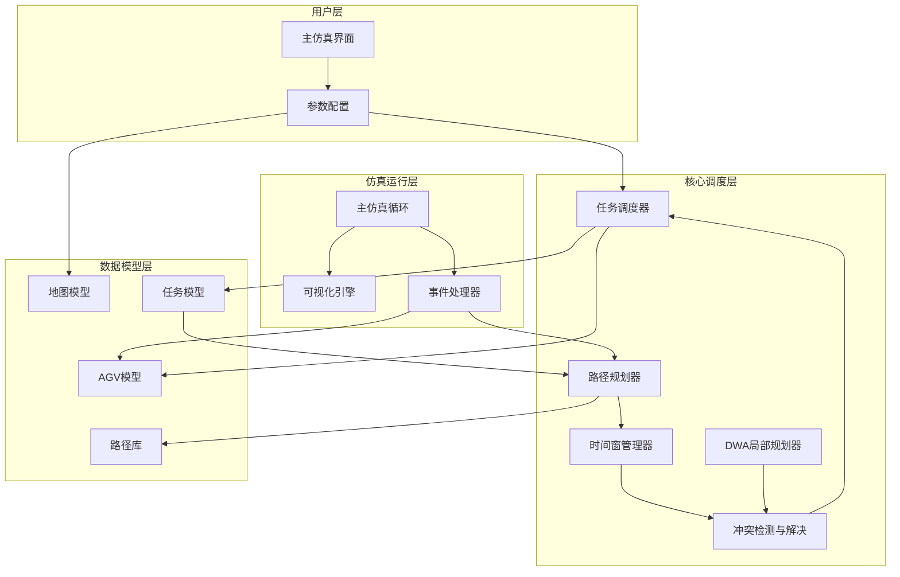
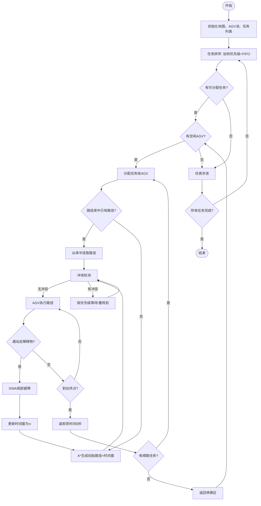
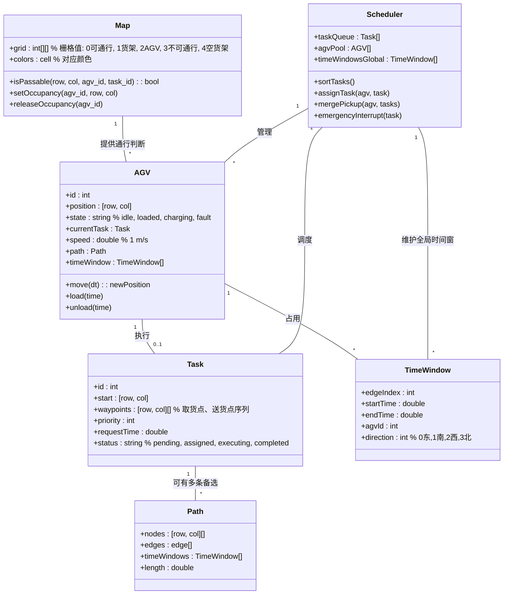

# 系统架构设计文档

## 1. 技术栈

- **仿真平台**: 已经可以运行MATLAB代码的Visual Studio Code
- **主要模块**: 地图建模、AGV建模、任务调度、路径规划（A*）、时间窗管理、冲突检测、DWA局部避障、仿真主循环、可视化
- **数据存储**: MATLAB 结构化数据（struct/class）、.mat 文件（路径库）
- **代码组织**: 面向对象与函数式混合，核心模块以类实现，辅助功能以函数封装

## 2. 系统架构图



## 3. 核心业务流程图



## 4. 数据模型图



## 5. API 设计（MATLAB 函数/类接口）

### 5.1 地图模块

- `map = MapClass(grid, colors)` 构造函数
- `isPassable = map.isPassable(row, col, agvId, taskId)` 判断可通行性，考虑货架临时开放和AGV占用
- `map.setAGVOccupancy(agvId, row, col)` 设置AGV位置（标记为2）
- `map.clearAGVOccupancy(agvId)` 清除AGV占用
- `map.getColor(row, col)` 获取栅格颜色

### 5.2 AGV模块

- `agv = AGVClass(id, startPos, speed)` 构造函数
- `agv.move(dt)` 更新位置，返回是否到达下一节点
- `agv.assignTask(task)` 分配任务，生成路径
- `agv.updateState(newState)` 更新状态
- `agv.loadCargo(time)` 装货，耗时5秒
- `agv.unloadCargo(time)` 卸货，耗时5秒

### 5.3 路径规划模块

- `path = AStar(map, start, goal, agvId, taskId)` 改进A*算法
- `pathSet = generatePathLibrary(map, task, numPaths)` 半离线生成多条路径
- `[success, newPath] = replan(agv, conflictInfo)` 冲突时重规划

### 5.4 时间窗管理

- `twManager = TimeWindowManager()` 构造函数
- `twManager.addTimeWindow(agvId, edge, start, end, direction)`
- `[conflict, conflictInfo] = twManager.detectConflict(newTW, allTW)`
- `twManager.reservePath(agvId, path, startTime)` 为整个路径预留时间窗
- `twManager.releasePath(agvId, path)` 释放时间窗

### 5.5 DWA局部规划

- `newPath = DWA(agv, map, obstacles, globalPath)` 动态窗口法局部路径
- `[v, w] = dwaControl(currentPos, targetPos, obstacles, params)` 速度采样与评价

### 5.6 调度器

- `scheduler = SchedulerClass(map, agvPool, taskList)` 构造函数
- `scheduler.updatePriority()` 根据等待时间加权更新优先级
- `nextTask = scheduler.getNextTask()` 按优先级+FIFO取任务
- `scheduler.assignToAGV(agv, task)` 分配并触发路径规划
- `scheduler.handleConflict(agv, conflictInfo)` 冲突解决（等待/重规划）
- `scheduler.emergencyInsert(task)` 紧急插队

### 5.7 仿真主循环

- `sim = Simulation(map, agvPool, taskList, totalTime)` 构造函数
- `sim.run()` 运行仿真，步进dt=0.1s
- `sim.render()` 实时显示地图、AGV、路径
- `sim.log(event)` 记录事件（任务完成、冲突、避障等）

### 5.8 辅助函数

- `dist = manhattan(p1, p2)` 曼哈顿距离
- `time = computeTravelTime(path, speed, loadTime)` 计算路径耗时
- `path = smoothPath(path)` 路径平滑（可选）

---

## 6. 目录结构（MATLAB项目）

```
MultiAGV_Sim/
├── +map/                     % 地图模块包
│   ├── MapClass.m
│   └── utils.m
├── +agv/                     % AGV模块包
│   ├── AGVClass.m
│   └── States.m
├── +task/                    % 任务模块包
│   ├── TaskClass.m
│   └── TaskParser.m
├── +pathplan/                % 路径规划包
│   ├── AStar.m
│   ├── DWAClass.m
│   └── PathLibrary.m
├── +timewindow/              % 时间窗管理包
│   └── TimeWindowManager.m
├── +scheduler/               % 调度器包
│   └── SchedulerClass.m
├── +sim/                     % 仿真主循环包
│   ├── Simulation.m
│   └── Visualizer.m
├── data/                     % 数据文件
│   ├── map_config.mat
│   ├── task_list.mat
│   ├── agv_pool.mat
│   └── path_library.mat
├── tests/                    % 测试脚本
│   ├── test_map.m
│   ├── test_astar.m
│   ├── test_dwa.m
│   └── test_scheduler.m
├── main.m                    % 主入口脚本
├── params.m                  % 全局参数配置
├── MAP.m                     % 地图数据参考
├── architecture.md
├── AGENTS.md
├── progress.txt
├── task.json
└── README.md
```

---

## 7. 关键参数默认值

- AGV速度: 1 m/s
- 装卸货时间: 5 s
- 仿真时间步长: 0.1 s
- 安全距离: 2 个栅格（车身长度+速度补偿）
- 路径库容量: 每个任务最多 3 条路径
- 时间窗粒度: 0.1 s
- 优先级权重: 等待时间权重系数 w = 0.1
- 紧急订单优先级偏移: 1000
